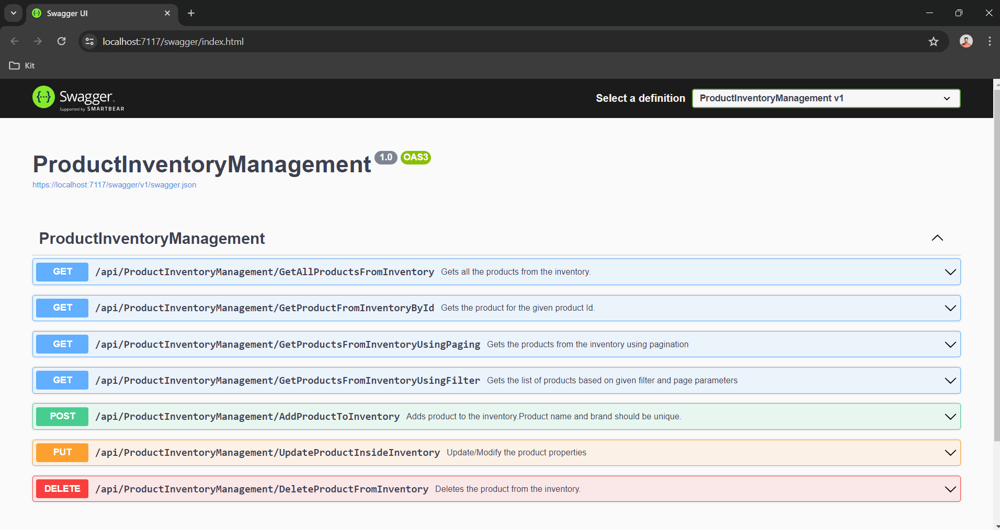

# ProductInventoryManagement
### Manage Products using CRUD operations with ASP.NET Core WebAPI

**Running the API**
1. Prerequisites:
    - Visual Studio 2022
    - Install .NET 6 SDK if you haven’t already.
    - Ensure you have a SQL Server instance.
2. Clone the Repository:
    - Clone your project repository to your local machine.
4. Configure Database Connection:
    - Open the appsettings.json file in your project.
    - Update the DefaultConnection string with your database connection details (if using SQL Server).
5. Database Initialization:
    - Delete all existing migrations from the Migrations folder.
    - Open the Package Manager Console (PMC) and run the following commands:
      - Add-Migration "v1"
      - Update-Database
    - The **Add-Migration v1** command will create a migration script that sets up the database schema based on your current model.
    - The **Update-Database** command will apply the migration and create the database.
6. Build and Run:
    - Open a terminal/command prompt in the project directory.
    - Run the following commands:
      - dotnet restore
      - dotnet build
      - dotnet run
7. API Endpoints:
    - Use Swagger for API documentation at https://localhost:7117/swagger/index.html
       - 
    - You can test them using tools like Postman or your browser.
8. Sample Request:
    - Get all the products from the inventory:
      - https://localhost:7117/api/ProductInventoryManagement/GetAllProductsFromInventory
    - Get the products from the inventory using filter and pagination:
      - https://localhost:7117/api/ProductInventoryManagement/GetProductsFromInventoryUsingFilter?Name=Mouse&Brand=HP&MinPrice=50&MaxPrice=600&PageNumber=1&PageSize=10
9. Logging using Serilog:
    - Run the application and check the console or the ProductInventoryManagementLogs.txt file for logged messages under the project directory.
